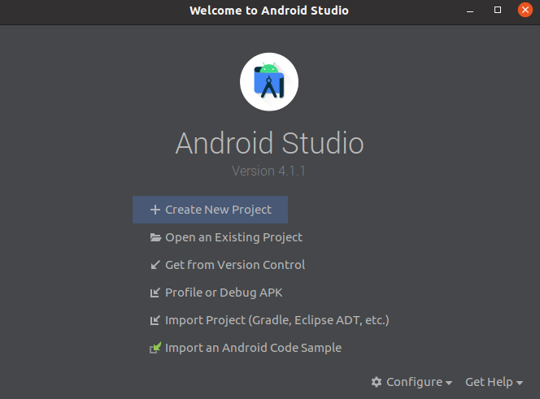
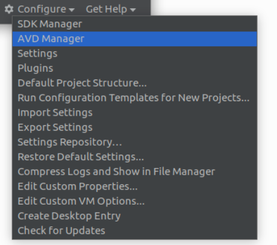
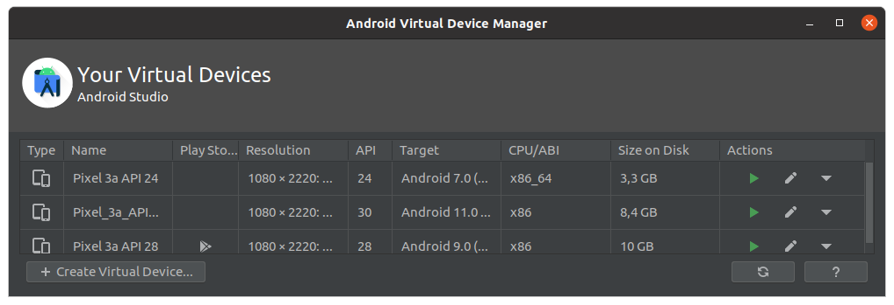
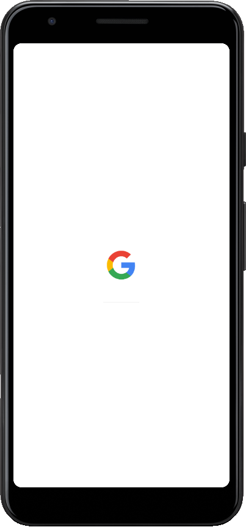
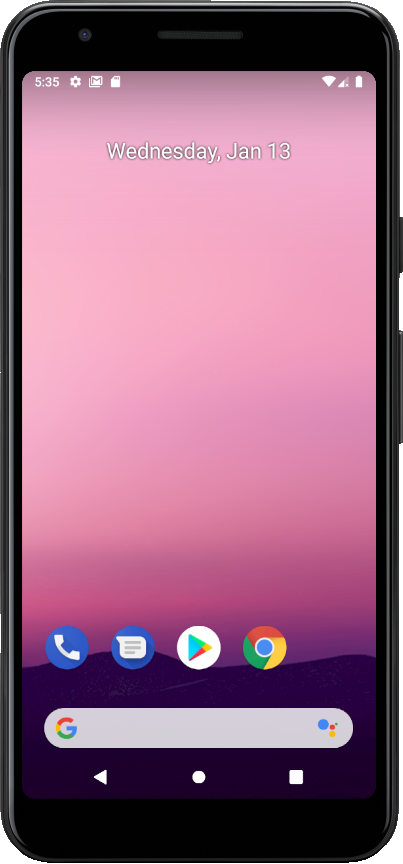
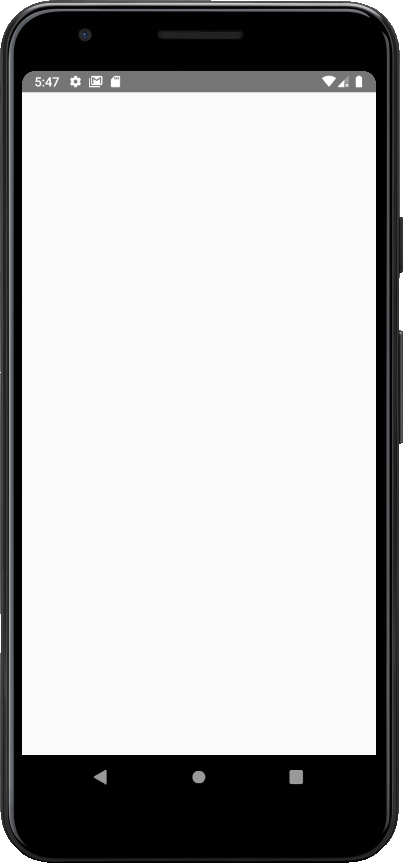

# [Example App with React-Native]

# ----

App created with React Native to manage between Example App for both IOS/Android platforms with React Native. This is a native App!

After correctly installed all the dependencies for a React Native Development, please follow the steps bellow to Create a Very New React Native Project!


**Table of Contents**

[TOC]


# 1. Initialize a new React-Native Project

## 1.1. Create a new React-Native Project

Open a Terminal from your React Native development directory, then initialize a very new project with `nodejs` and `npm` installed:

```bash
# Init a new React-Native Project
npx react-native init rn_example_app

# Go to the Project Directory Generated
cd rn_example_app

# Open the Project directory in the Visual Code
code .
```


## 1.2. Modify default files

Modify the default files in order to organize the files inside the project:

- Delete `eslintrc.js` file from the top level directory 
- Delete `App.js` file from the top level directory
- Create a `src/` folder from the top level directory
- Create a `src/index.js` file to be the `entrypoint` instead of `App.js` file
- In `index.js`, at the top level directory, modify the following line to match `./src` instead of `./App`

```js
// Modify this:
...
import App from './App';
...

// To match this:
import {AppRegistry} from 'react-native';
import App from './src';
import {name as appName} from './app.json';

AppRegistry.registerComponent(appName, () => App);
```

- In `src/index.js`, create a `Funcional Component` to generate a default `App` Screen:

```js
import React from 'react';
import { View, Text } from 'react-native';

// import { Container } from './styles';

const App = () => {
  return <View />;
}

export default App;
```


## 1.3. Or Clone this Project and install (Skip 1.1 and 1.2 steps)
Once the project was extract and moved to the correct directory, just open the VisualStudio Code from this directory with:

```bash
# Open the Project directory in the Visual Code
code .
```
And run the following command from Visual Studio Code Terminal:

```bash
# Install this Project Packages
yarn
```


## 1.4. Launch Android Specific Emulator (optional)

Launch the `Android Emulator` installed from `android-studio`

- With the `android-studio` and `Android SDK` correctly installed, launch from an external `Terminal` from anywhere ant type the following command line to start `android-studio`:`


```bash
studio.sh
```




- Then select `Configure --> AVD Manager`




- The `Andorid Virtual Device Manager` shall be opened. The select specific `Android Emulator` version and press the `Play` button under the `Actions` column



- The `Android Emulator` shall boot as the following Picture:




- After the boot, there was a Main Screen Android and the `Android Emulator` is ready to work. 



The command line to check the attached `Android Emulator` device is

```bash
adb devices
----
List of devices attached
emulator-5554	device
```

This list above shows the a device named `emulator-5554` is attached to the `adb devices` list

> *Note: `adb devices` are binded to the `8081` `localhost` port. So anything that attempts to connect at this port or another `Android Emulator` device shall not be run and failed because the port had already been bound to this application.*


## 1.5. Start the React-Native Project App

- Open the terminal inside the `Visual Code IDE` typing `Ctrl + ` `

- Execute the following command to start the `package.json` dependencies and the `App`:

```bash
yarn start
```

- Then, split the terminal and start the default`Android Emulator` installed from `android-studio`:

```bash
yarn react-native run-android
```

At this point, the `Android Emulator`  or `Android Device` shall be successfully build and the `App` shall be correctly installed with a `blank screen` because there is no component yet inside the `App`.




# 2. React-Native App Development

## 2.1. Prepare the Envornment for the Code

After installed all dependencies from the moment, the application can be initialized again just typing the following command in `VS Code Terminal`:

``` bash
yarn start --reset-cache
```

The dependencies installed have not been installed in the App. So the following command is necessary after each dependency or building files changing, please re-run:

```bash
# For Android Devices
yarn react-native run-android
```


### 2.1.1. Create the Project Tree Directory

To organize and be able to scale up the project, please create the following directories from inside `src` directory:

- A new directory called `api`
- A new directory called `assets`
- A new directory called `components`
- A new directory called `config`
- A new directory called `docs`
- A new directory called `screens`
- A new directory called `services`
- A new directory called `store`
- A new directory called `styles`
- A new directory called `utils`


#### 2.1.1.1. Api

In `api` directory shall contain logic related to external API communications.

- `src/api/`


#### 2.1.1.2. Assets

In `assets` directory shall contain all the `fonts` and `images` used in the App Project, i.e., all the structural static files.

- `src/assets/bootsplash`
- `src/assets/images`
- `src/assets/fonts`


#### 2.1.1.3. Components

In `components` directory shall contain most part of the Components used more than once in the App Project

Create new trees for `StatusBarView` component:

- `src/components/StatusBarView/index.js`


#### 2.1.1.4. Config

In `config` directory shall contain plugins configuration and development environment variables.


#### 2.1.1.5. Docs

In `docs` directory shall contain most part of the Documentation of this App Project.


#### 2.1.1.6. Screens

In `screens` directory shall contain most part of the Screens used in the App Project

Create new tree for the `ScanQRCodeSccreen` screen. This should be the first screen when the App is opened:

- `src/screens/HomeScreen/index.js`


#### 2.1.1.7. Services

In `src/services` directory shall contain the Services Components. Services Components are components that establishes an external communication over tcp, udp, mqtt, sockets and others that provide an path to communicate to the external world.


#### 2.1.1.8. Store

In `src/store` directory shall contain the shared variables used for more the on Component. For example, variables from the `useContext` hook, that are shared from the Parent Component over other Children Component locates in other file in the App Project,


#### 2.1.1.9. Styles

In `src/styles` directory shall contain the common styles in the App, like `Themes` of `Screens` or `StatusBar`:

- `src/styles/index.js`


#### 2.1.1.10. Utils

In `utils` directory shall contain most part of the Miscellaneous Utilities used in the App Project,

- `src/utils`


## 2.2. Modify App Name

### 2.2.1. Modify the Default App Name - Android

To modify the default App name in Android is very simple. Just modify the `name` property of string component at `android/app/src/main/res/values/string.xml`.

```xml
<resources>
    <string name="app_name">App Name</string>
</resources>
```


### 2.2.3. Release the Changes

To apply the changes at `android/` level, the App must be built again. So, the following command to release them:

```bash
yarn react-native run-android
```


## 2.3. Set the Boot Splash Screen Package

### 2.3.1. Import  react-native-bootsplash and add it to the project

From: https://github.com/zoontek/react-native-bootsplash

*Description: Show a bootsplash during app startup. Hide it when you are ready.*

- To add `react-native-module` in the dependencies of the `package.json` file in the project, go to the top level project directory and `add` the module with `yarn add` command line. If `yarn start` command is still running in the `VS Code` terminal, please, stop it with `Ctrl^C` keyboard keys.

```bash
# Add yarn dependencies for the bootsplash screen into the Project:
yarn add react-native-bootsplash
```


### 2.3.2. Assets generation

In order to speed up the setup, there is a provided `CLI` to generate assets, create the Android Drawable `XML` file and the `iOS Storyboard` file automatically The `package.json` file must be as following in `dependencies` object:

``` json
yarn react-native generate-bootsplash src/assets/bootsplash/logo_bootsplash_1024x1024.png --background-color=#F5F5F5   --logo-width=300   --assets-path=assets
```

This tool relies on the naming conventions that are used in the  project and will therefore create the following files:

```bash
android/app/src/main/res/drawable/bootsplash.xml
android/app/src/main/res/values/colors.xml (creation and edition)
android/app/src/main/res/mipmap-hdpi/bootsplash_logo.png
android/app/src/main/res/mipmap-mdpi/bootsplash_logo.png
android/app/src/main/res/mipmap-xhdpi/bootsplash_logo.png
android/app/src/main/res/mipmap-xxhdpi/bootsplash_logo.png
android/app/src/main/res/mipmap-xxxhdpi/bootsplash_logo.png
```


### 2.3.3. Modify MainActivity.java file

- Edit `android/app/src/main/java/com/rn_example_app/MainActivity.java`:

```java
package com.rn_example_app;

import android.os.Bundle;

import com.facebook.react.ReactActivity;
import com.zoontek.rnbootsplash.RNBootSplash;

public class MainActivity extends ReactActivity {

  /**
   * Returns the name of the main component registered from JavaScript. This is used to schedule
   * rendering of the component.
   */
  @Override
  protected String getMainComponentName() {
    return "rn_example_app";
  }

  @Override
  protected void onCreate(Bundle savedInstanceState) {
    super.onCreate(savedInstanceState);
    RNBootSplash.init(R.drawable.bootsplash, MainActivity.this);
  }
}
```


### 2.3.4. Modify styles.xml file

- Edit `android/app/src/main/res/values/styles.xml`: to create a main activity before launching the app, we need to display a different activity at start, then switch to our main one.

```xml
<resources>

  <!-- Base application theme -->
  <style name="AppTheme" parent="Theme.AppCompat.Light.NoActionBar">
    <!-- Your base theme customization -->
    <item name="android:textColor">#000000</item>
  </style>

  <!-- Add the following lines (BootTheme should inherit from AppTheme) -->
  <style name="BootTheme" parent="AppTheme">
    <!-- set the generated bootsplash.xml drawable as activity background -->
    <item name="android:background">@drawable/bootsplash</item>
  </style>

</resources>
```


### 2.3.5. Edit AndroidManifest.xml file

- Edit the `android/app/src/main/AndroidManifest.xml` file:

```xml
<manifest xmlns:android="http://schemas.android.com/apk/res/android"
  package="com.rn_example_app">
    
  <uses-permission android:name="android.permission.INTERNET" />
  <!-- … -->


  <!-- Modify android:icon and android:roundIcon to bootsplash_logo -->
  <application
    android:name=".MainApplication"
    android:label="@string/app_name"
    android:icon="@mipmap/bootsplash_logo"
    android:roundIcon="@mipmap/bootsplash_logo"
    android:allowBackup="false"
    android:theme="@style/AppTheme">

    <activity
      android:name=".MainActivity"
        android:label="@string/app_name"
        android:configChanges="keyboard|keyboardHidden|orientation|screenSize|uiMode"
        android:launchMode="singleTask"
        android:windowSoftInputMode="adjustResize"
        android:exported="true">
      <!-- add android:exported="true" above -->
      <!-- add android:launchMode="singleTask" above -->
      <!-- remove the <intent-filter> from .MainActivity -->
    </activity>

    <!-- add the following lines (use the theme you created at step before) -->
    <activity
      android:name="com.zoontek.rnbootsplash.RNBootSplashActivity"
      android:theme="@style/BootTheme"
      android:launchMode="singleTask">
      <intent-filter>
        <action android:name="android.intent.action.MAIN" />
        <category android:name="android.intent.category.LAUNCHER" />
      </intent-filter>
    </activity>

    <!-- … -->

  </application>
</manifest>
```


## 2.4. Change App Icon

### 2.4.1. Modify AndroidManifest.xml

To match the new icon folder name generated from above, two lines must me changed in `android/app/src/main/AndroidManifest.xml`. This step should be achieved in the item just above:

```xml
<application
  ...
  android:icon="@mipmap/bootsplash_logo"
  android:roundIcon="@mipmap/bootsplash_logo"
  ...
</application>
```


### 2.4.2. Release the Changes

To apply the changes at `android/` level, the App must be built again. So, the following command to release them:

```bash
yarn react-native run-android
```


## 2.5. Writing the Code

### 2.5.1. Write the code for the HomeScreen/index.js

- In `src/screens/HomeScreen/index.js`, create a `Funcional Component` to generate a default `App` Screen:

```js
import React from 'react';
import { View, Text } from 'react-native';

const App = () => {
  return (
    <View>
      <Text>Welcome to the React Native Example App!</Text>
    </View>
  );
}

export default App;
```


### 2.4.3. Write the code for the BootSplash Animation in src/index.js

- Edit `src/index.js` file, that is the first file the Application shall read to really mount the Screen Components and release the screen transition  after the Animated View from Bootsplash moment be unmounted:


```jsx
import React, { useEffect, useRef, useState } from "react";
import { Animated, Dimensions, StyleSheet, Text, View } from "react-native";
import BootSplash from "react-native-bootsplash";

import HomeScreen from './screens/HomeScreen';

import bootSplashLogo from "./assets/images/bootsplash/logo_bootsplash_1024x1024.png";


let fakeApiCallWithoutBadNetwork = (ms) =>
  new Promise((resolve) => setTimeout(resolve, ms));

let App = () => {
  let [bootSplashIsVisible, setBootSplashIsVisible] = useState(true);
  let [bootSplashLogoIsLoaded, setBootSplashLogoIsLoaded] = useState(false);
  let opacity = useRef(new Animated.Value(1));
  let translateY = useRef(new Animated.Value(0));

  let init = async () => {
    // You can uncomment this line to add a delay on app startup
    // await fakeApiCallWithoutBadNetwork(3000);

    await BootSplash.hide();

    Animated.stagger(250, [
      Animated.spring(translateY.current, {
        useNativeDriver: true,
        toValue: -150,
      }),
      Animated.spring(translateY.current, {
        useNativeDriver: true,
        toValue: Dimensions.get("window").height,
      }),
    ]).start();

    Animated.timing(opacity.current, {
      useNativeDriver: true,
      toValue: 0,
      duration: 130,
      delay: 750,
    }).start(() => {
      setBootSplashIsVisible(false);
    });
  };

  useEffect(() => {
    bootSplashLogoIsLoaded && init();
  }, [bootSplashLogoIsLoaded]);

  return (
    <View style={styles.container}>
      <View>
        <HomeScreen />
      </View>

      {bootSplashIsVisible && (

        <Animated.View
          style={[
            StyleSheet.absoluteFill,
            styles.bootsplash,
            { opacity: opacity.current },
          ]}
        >

          <Animated.Image
            source={bootSplashLogo}
            fadeDuration={0}
            onLoadEnd={() => setBootSplashLogoIsLoaded(true)}
            style={[
              styles.logo,
              { transform: [{ translateY: translateY.current }] },
            ]}
          />

        </Animated.View>
      )}
      
    </View>
  );
};

const styles = StyleSheet.create({
  container: {
    flex: 1,
    justifyContent: "center",
    alignItems: "center",
    backgroundColor: "#F5F5F5",
    
  },
  bootsplash: {
    flex: 1,
    justifyContent: "center",
    alignItems: "center",
    backgroundColor: "#F5F5F5",
  },
  logo: {
    height: 300,
    width: 300,
  },
});

export default App;
```


# 3. React-Native App Release

## 3.1. Deploy the App to Release and Generate the APK file

From: https://reactnative.dev/docs/signed-apk-android

### 3.1.1.  Generating an upload key

- From the top level project directory:

```bash
keytool -genkeypair -v -keystore my-upload-key.keystore -alias my-key-alias -keyalg RSA -keysize 2048 -validity 10000
```


### 3.1.2. Setting up Gradle variables

- Place the `my-upload-key.keystore` file under the `./android/app` directory in the project folder.

```bash
mv my-upload-key.keystore ./android/app/
```

- Edit the file `./android/gradle.properties` and add the following lines  (replace `*****` with the correct `keystore password`, `alias` and `key password`),

```bash
# Add my-upload-key.keystore file, upload_store_password and upload_key_password
MYAPP_UPLOAD_STORE_FILE=my-upload-key.keystore
MYAPP_UPLOAD_KEY_ALIAS=my-key-alias
MYAPP_UPLOAD_STORE_PASSWORD=*****
MYAPP_UPLOAD_KEY_PASSWORD=*****
```


### 3.1.3. Adding signing configuration to the App's Gradle configuration

- The last configuration step that needs to be done is to setup release builds to be signed using `upload key`. Edit the file `./android/app/build.gradle` in the project folder, and add the `signing config`:

```gradle
...
android {
    ...
    defaultConfig { ... }
    signingConfigs {
        release {
            if (project.hasProperty('MYAPP_UPLOAD_STORE_FILE')) {
                storeFile file(MYAPP_UPLOAD_STORE_FILE)
                storePassword MYAPP_UPLOAD_STORE_PASSWORD
                keyAlias MYAPP_UPLOAD_KEY_ALIAS
                keyPassword MYAPP_UPLOAD_KEY_PASSWORD
            }
        }
    }
    buildTypes {
        release {
           ...
            signingConfig signingConfigs.release
        }
    }
}
...
```


### 3.1.4. Generating the release APK

Run the following in any  Terminal:

```bash
cd android
./gradlew bundleRelease
```


### 3.1.5. Testing the release build of the App

```bash
yarn react-native run-android --variant=release
```


### 3.1.6. APK Released File Location

The generated `APK` file for the release from the App shall be located at:

````bash
/PATH/TO/THE/PROJECT/TOP/LEVEL/rn_qrcode_mqtt/android/app/build/outputs/apk/release/app-release.apk
````


